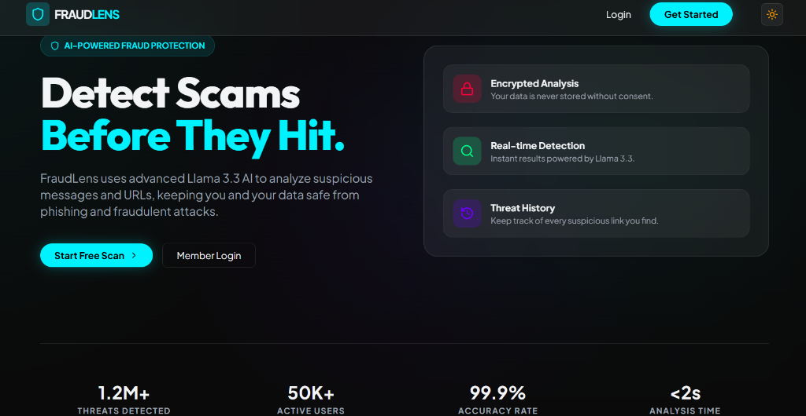
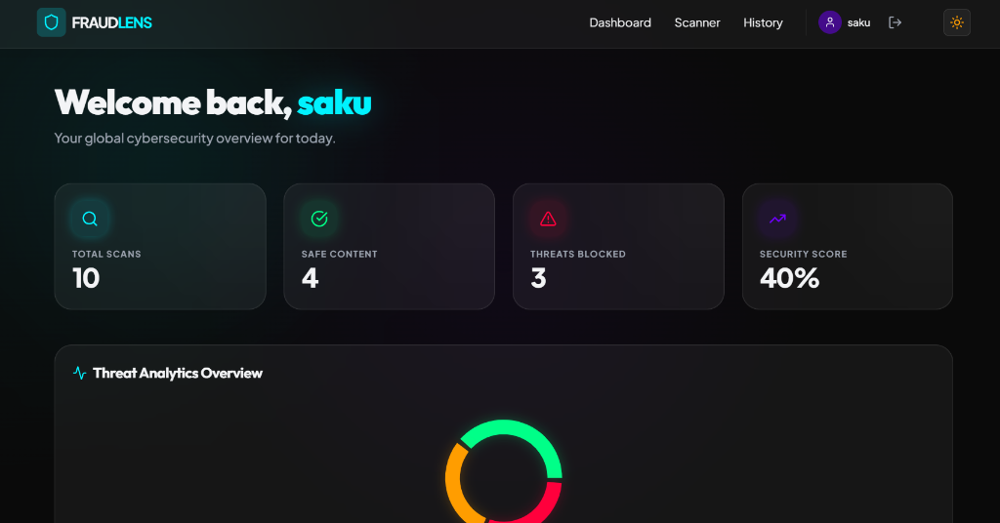
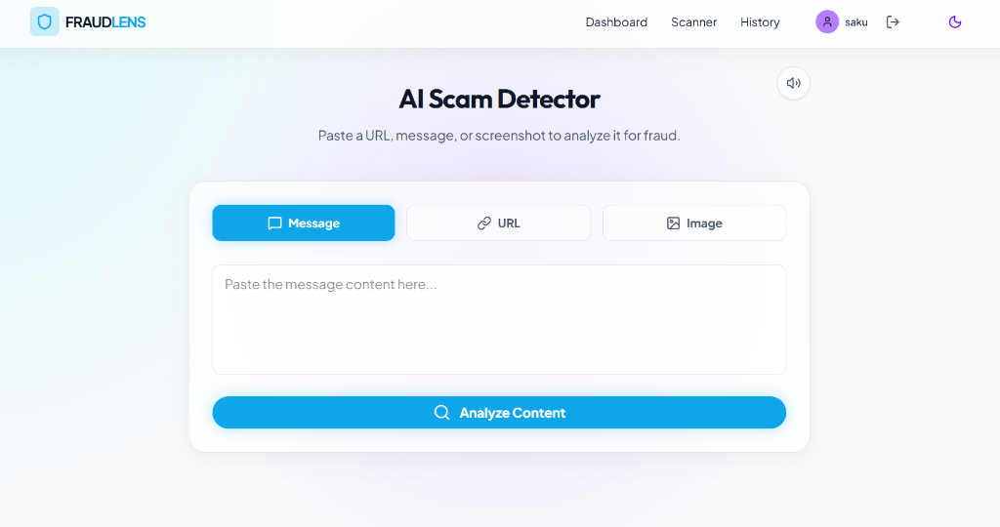
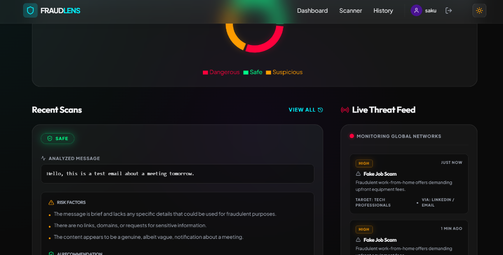
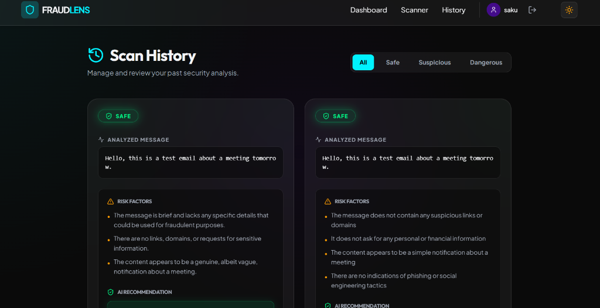
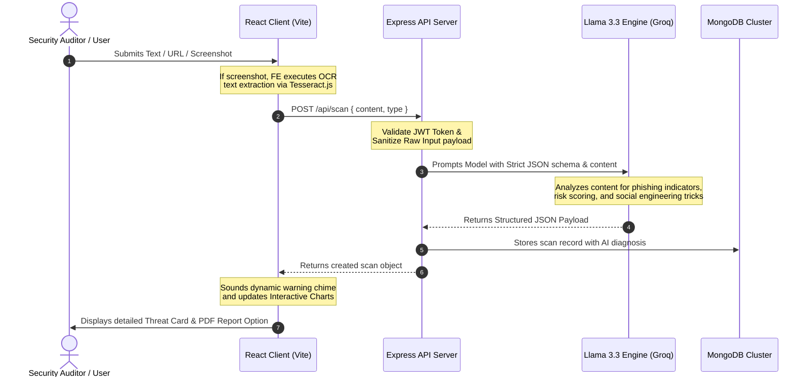

# 🛡️ FraudLens — AI Scam & Phishing Detection Platform

<div align="center">

[]()
[]()
[]()
[]()

**Detect Scams Before They Hit. Professional-Grade AI-Powered Threat Intelligence.**

[Explore Demo](#-demo) • [Installation](#-quick-start) • [Architecture](#%EF%B8%8F-architecture--workflow) • [Screenshots](#-product-tour)

</div>

---

### 📖 Table of Contents
- [🛡️ Hero & Overview](#%EF%B8%8F-hero--overview)
- [⚡ Core Features](#-core-features)
- [🖥️ Product Tour](#-product-tour)
- [🛠️ Tech Stack](#%EF%B8%8F-tech-stack)
- [⚙️ Architecture & Workflow](#%EF%B8%8F-architecture--workflow)
- [🚀 Quick Start](#-quick-start)
- [📂 Folder Structure](#-folder-structure)
- [🔌 API Flow](#-api-flow)
- [🔮 Future Roadmap](#-future-roadmap)
- [🤝 Contributing](#-contributing)
- [📄 License](#-license)

---

## 🛡️ Hero & Overview

**FraudLens** is a professional-grade cybersecurity SaaS platform built to shield individuals and organizations from the ever-evolving threat landscape of digital scams. Standard scanners rely purely on static, outdated blacklists; **FraudLens** leverages high-speed, state-of-the-art **Llama 3.3 (70B) AI** threat intelligence alongside OCR-powered screenshot scanners to dissect, analyze, and diagnose malicious intent in real time. 

Whether it is a spoofed bank notification, an urgent phishing SMS, a fraudulent cryptocurrency job offer, or a malicious URL disguised with URL-shortening tricks, FraudLens exposes the attack vectors before they can inflict damage.

---

## ⚡ Core Features

| Engine Vector | Detection Capability | Analysis Core | Status |
| :--- | :--- | :--- | :--- |
| **🔍 URL Scan Engine** | Detects malicious domains, spoofed brand links, and hidden URL redirections. | Real-time heuristics & DNS patterns | `PRODUCTION` |
| **💬 Message Analyzer** | Dissects social engineering tactics, panic-inducing language, and spoofing. | NLP semantic analysis (Llama 3.3) | `PRODUCTION` |
| **📸 OCR Image Scan** | Extracts written text from uploaded screenshots using optical character recognition. | Tesseract.js Engine | `PRODUCTION` |
| **📊 Threat Analytics** | Beautiful real-time security dashboard reporting threats blocked and safety scores. | Interactive Recharts Engine | `PRODUCTION` |
| **📋 PDF Threat Reports** | Generates detailed, professional cyber-threat reports with risk-factor lists. | jsPDF Autogen | `PRODUCTION` |

* **AI Threat Scoring**: Provides an instant numerical threat probability score (0-100%) paired with a reliability confidence rating.
* **Security Recommendations**: Dynamically generates tailored, actionable security guidelines for the user based on the analysis.
* **Global Threat Feed**: Emulates a security operations center (SOC) monitor showing global active threat reports rotating in real time.

---

## 🖥️ Product Tour

Here is a visual walkthrough of the FraudLens user flow, showcasing the responsive design, rich cyber-themed aesthetics, and modern glassmorphism UI:

### 1. The Gateway (Landing Page)
The user begins at our high-contrast, professional landing page loaded with micro-animations, theme toggle capability, and clear value metrics.


### 2. Live Threat Operations (Dashboard Statistics)
Once logged in, users get a comprehensive look at their personal security posture, scanning logs, and dynamic charts visualizing threat trends.


### 3. The Security Core (AI Scam Detector)
Users paste content, URLs, or drag-and-drop suspicious screenshots. The OCR engine instantly transcribes texts for real-time Llama analysis.


### 4. SOC Threat Center (Threat Analytics & Live Feed)
Real-time tracking of active phishing campaigns and scams monitored globally on an interactive network map overlay.


### 5. Historical Analysis Logs (Scan History)
A dedicated ledger archiving all past threat scans. Users can review, filter, or download detailed PDF threat reports for offline compliance.


---

## 🛠️ Tech Stack

<div align="center">

| Layer | Technologies |
| :--- | :--- |
| **Frontend** | React 19 • Vite • Tailwind CSS 4 • Framer Motion • Recharts |
| **Backend** | Node.js • Express • REST APIs • JWT Auth |
| **Database** | MongoDB • Mongoose ODM |
| **AI / OCR** | Llama 3.3 70B (via Groq SDK) • Tesseract.js |
| **Services** | Audio Notifications Web API • jsPDF • React Hot Toast |

</div>

---

## ⚙️ Architecture & Workflow

Below is the conceptual threat-analysis pipeline of the FraudLens platform:



---

## 🚀 Quick Start

### 📋 Prerequisites
* Node.js (v18+ recommended)
* MongoDB (Local Instance or Atlas Cluster)
* Groq API Key (For Llama 3.3 LLM access)

### 🔧 1. Clone & Install Dependencies
```bash
# Clone the repository
git clone https://github.com/sakshimadkar/FraudLens.git
cd FraudLens

# Install Server Dependencies
cd server
npm install

# Install Client Dependencies
cd ../client
npm install
```

### 🔑 2. Configure Environment Variables
Create a `.env` file in the `/server` directory:
```env
PORT=5000
MONGO_URI=mongodb://localhost:27017/fraudlens
JWT_SECRET=your_super_secret_jwt_signature
GROQ_API_KEY=gsk_your_groq_key_here
```

### ⚡ 3. Fire up the Engines
```bash
# Terminal 1: Backend API
cd server
npm run dev

# Terminal 2: React Client
cd client
npm run dev
```
Open your browser and navigate to `http://localhost:5173`.

---

## 📂 Folder Structure

```filepath
FraudLens/
├── client/                 # React Frontend
│   ├── public/             # Static Assets & Favicons
│   └── src/
│       ├── assets/         # App Assets
│       ├── components/     # UI Components (ScanCard, Navbar, etc.)
│       ├── context/        # React Contexts (Auth, Theme)
│       ├── pages/          # Pages (Dashboard, Scanner, History, Landing)
│       └── utils/          # Web Audio helper utilities
├── server/                 # Express Backend
│   ├── controllers/        # Request handling logic (auth, scan)
│   ├── middleware/         # Security & JWT interceptors
│   ├── models/             # Mongoose Database Schemas
│   └── routes/             # API Endpoints Router
└── screenshots/            # Product Walkthrough Images
```

---

## 🔌 API Flow

The `/scan` route is secured via JWT authentication:

* **Endpoint**: `POST /api/scan`
* **Headers**: `Authorization: Bearer <TOKEN>`
* **Payload**:
  ```json
  {
    "content": "Urgent HDFC: Your net banking will be locked. Please verify at http://hdfc-bank-safe-portal.com",
    "type": "message"
  }
  ```
* **Engine Response Format**:
  ```json
  {
    "result": "Dangerous",
    "riskScore": 95,
    "confidence": 98,
    "reasons": [
      "Spoofed domain trying to impersonate HDFC bank.",
      "Improper domain name structure with suspicious extension.",
      "Urgency bias applied to force quick user reaction."
    ],
    "keywords": ["Verify", "Locked", "HDFC"],
    "phishingIndicators": ["Domain spoofing", "Suspicious link"],
    "socialEngineeringTactics": ["Artificial panic", "Impersonating authority"],
    "recommendation": "DO NOT click the link. Report this SMS as fraud immediately to HDFC customer service."
  }
  ```

---

## 🔮 Future Roadmap

- [ ] **Browser Extension**: Real-time background shield highlighting suspicious active tabs & search results.
- [ ] **WhatsApp Guard**: Dedicated API bot analyzing text messages forwarded by users.
- [ ] **E-mail Scanner**: Outlook / Gmail integration to flag incoming phishing campaigns natively.
- [ ] **Interactive Voice Analysis**: Scanning audio/voice files for tele-fraud spoofing vectors.
- [ ] **Localization**: Deep multi-language scanning support for region-specific threat alerts.

---

## 🤝 Contributing

Contributions are welcome! Please follow these guidelines:
1. Fork the Project.
2. Create your Feature Branch (`git checkout -b feature/AmazingFeature`).
3. Commit your Changes (`git commit -m 'Add some AmazingFeature'`).
4. Push to the Branch (`git push origin feature/AmazingFeature`).
5. Open a Pull Request.

---

## 📄 License

Distributed under the **MIT License**. See `LICENSE` for more details.

---

<div align="center">
Built with ❤️ for a safer, scam-free digital world.
</div>
